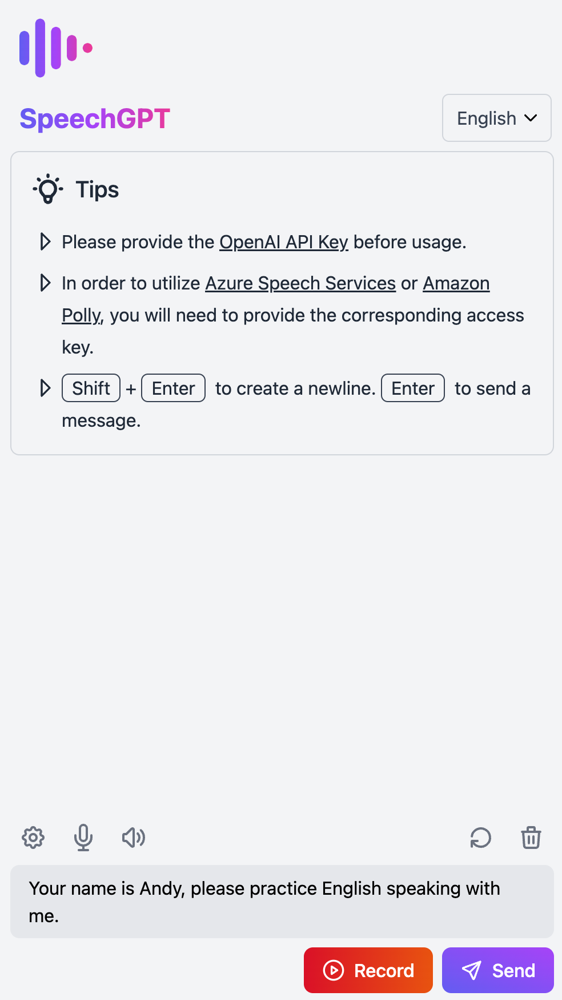
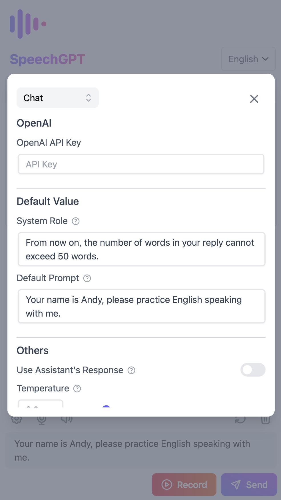
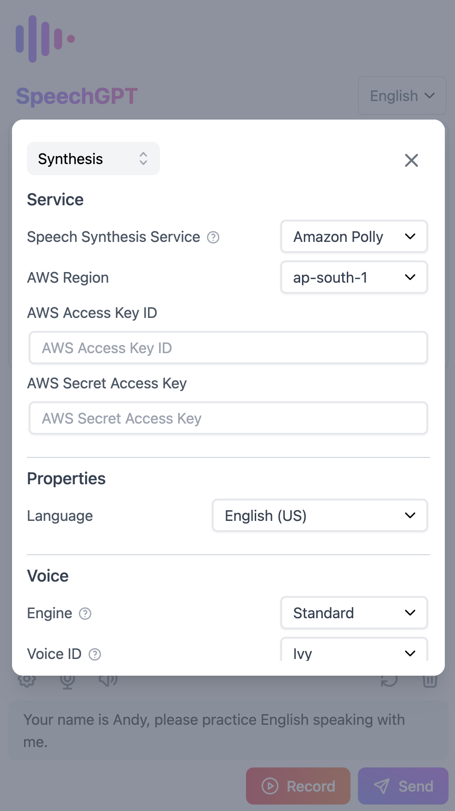

## 🌟 Introduction

Interview.IO is a web application that enables you to have mock interview with custom AI ChatBOT 
You can utilize this app to improve your interview skills and practice through speech-to-speech communication

## 🚀 Features

- 📖 **Open source and free**:
- 🔒 **Privacy First**:
- 📱 **Mobile friendly**
- 📚 **Support for multiple languages**
- 🎙 **Speech Recognition**
- 🔊 **Speech Synthesis**

## 📸 Screenshots

<table>
  <tr>
    <td></td>
    <td></td>
    <td></td>
  </tr>
</table>

## 📖 User Guide

1. Make sure you cloned our interview.io BackEnd repository and follow all the guidelines in BackEnd readme

2. When you start a new chat, the app will pop out a modal to ask for user configuration to customize the chatbot

3. Once finish input all the chatbot config, the chatbot will ask for self-introduction to init the interview

4. User can use voice recording button to record their voice and response to the question through Q&A

## 💻 Development Guide and Changelog

- For more information on setting up your development environment, please see our [Development Guide](./docs/developer-guide.md).
- To view the project's history of notable changes, please check the [Changelog](./CHANGELOG.md).

## 🚢 Deployment

### Deploying with Docker in local

1. Build a docker image
    
   `docker build -t [input a image name] .`

2. Run a docker image
    
   `docker run -d -p 8080:8080 --name [container name] [your image]`

### The step we take to deploy the image in GCP (For reference)

0. (Login on GCP in terminal)

1. `docker tag [your image] gcr.io/[project id]/[your image]:latest`

2. `docker push gcr.io/[project id]/[your image]:latest`

3. `gcloud run deploy [image name] --image gcr.io/[project id]/[your image]:latest --platform managed --region asia-east2`

## 📄 License

This project is licensed under the terms of the [MIT license](/LICENSE).
